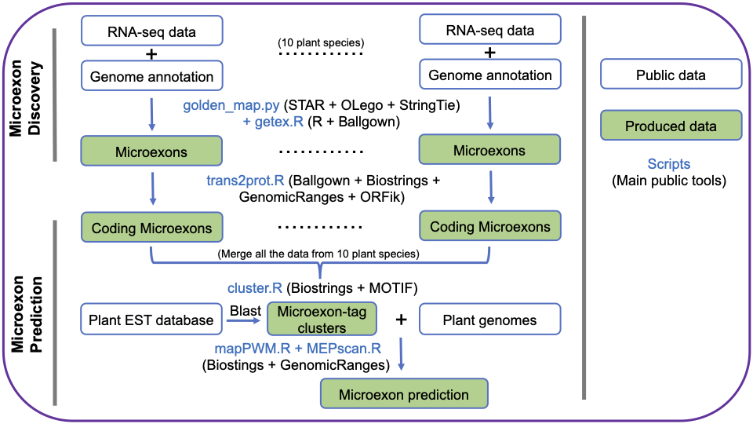

# MEP: Discovery and Prediction of <i>M</i>icro<i>E</i>xons in <i>P</i>lants

+ The pipeline golden_map.py can be used for general RNA-seq mapping and gene expression analysis in plants.
+ There is a strand-alone tool [MEPscan](https://github.com/yuhuihui2011/MEPscan) for micreoxon prediction in plants. 
+ The flow chart of the whole pipeline is as follows:



## 1. golden_map.py
A python pipeline of short-read RNA-seq mapping in plants: 
1. First round of mappping using [STAR](https://github.com/alexdobin/STAR)
2. Generate new genome index for [STAR](https://github.com/alexdobin/STAR) 
3. second round of mappping using [STAR](https://github.com/alexdobin/STAR)
4. Assemble novel transcripts with [StringTie](https://github.com/gpertea/stringtie)
5. Estimate gene expression with [StringTie](https://github.com/gpertea/stringtie)

### Note:
+ The ouput is ready for input of [Ballgown](https://github.com/alyssafrazee/ballgown).
+ Additaional splice junction information can be added from the result of other tools, 
such as [OLego](https://github.com/chaolinzhanglab/olego).

### Usage:
> python3 golden_map.py -h
<pre>Usage: golden_map.py [options]

Options:
  -h, --help       show this help message and exit
  -i INPUT         input file directory or file list (.)
  -p PATTERN       input file pattern (_1P.fq.gz)
  -l LENGTH        read length (101)
  -f FASTA         reference genome fasta file
  -x INDEX         STAR genome index directory
  -n NBASES        length of the STAR SA indexing string (14)
  -j JUNCTION      file for the splice junction introns ("")
  -g GTF           reference annotation GTF file
  -@ THREADS       number of threads (30)
  -e, --expresion  estimate gene expression
  -a, --assemble   assemble novel transcripts
</pre>

### Example:
> python3 ./golden_map.py -i simulated_reads -p .fq.gz -l 50 -f A.thaliana.fa -x star_idx -n 12 -j olego_junc.SJ -g A.thaliana.gtf -e -a
+ The file pattern (-p) is the suffix of fastq files. For paired end, the pattern must contain the number 1 and the pipeline will search and match the second read files; otherwise, will treat as single end.
+ The input (-i) can be a path to the directory or a file list containing the paths to all the fastq files, one per line (files will be automatically paired according to the pattern). 
+ GZ or BZ2 compressed files can be accepted.
+ Extra intron junction file (-j) should contains 4 columns: separated by tabs Chr\tStart\tEnd\tStrand and will pass to '--sjdbFileChrStartEnd' for STAR. Please note that Start and End are first and last bases of the introns (1-based chromosome coordinates), which are different from those in OLego junction file (in BED format). For more information, see [STAR](https://github.com/alexdobin/STAR) and [OLego](https://github.com/chaolinzhanglab/olego).
+ The sorted bam files are in "map2" directory and expression files are in "ballgown" directory.
+ The assembled transcrpts are in merged.gtf file.
+ To collect exon/intron/transcript level expression, open R and run:  
```{r}
 library(ballgown)
 bg<-ballgown(samples=list.dirs("ballgown",recursive = FALSE))
 bg
```

## 2. getex.R
Get the coordinates of internal exons and the flanking introns from a ballgown object.

### Usage:
> getex(bg, genome, min.junction=5, min.samples=1)

### Return:
<pre>A list of exon and intron GRanges. The microexons are the smallest internal exons with the size <= 15 nt.</pre>

### Example:
```{r}
library(ballgown)
library(GenomicRanges)
library(Biostrings)
library(BSgenome)
genome<-readDNAStringSet("A.thaliana.fa")
names(genome)<-sub("^(\\S+)\\s+.*","\\1",names(genome))
splice<-getex(bg_at, genome)
mex<-splice$ex[width(splice$ex)<=15]
```

## 3. trans2prot.R
Get the longest ORFs from all assembled transcripts and translate the coding sequences to proteins

### Usage:
> trans2prot(bg, genome, mex, minsize=50, mincov=1, MSTRG="At")

### Return:
<pre>A list of AAStringSet of protein sequences, GRangesList of transcripts, GRangesList of ORFs containing all 
coding exons and GRangeslist of ORFs containing coding microexons. </pre>

## 4. cluster.R
Cluster coding microexons:
1. Get the position and the phase of miroexons in coding sequences and proteins
2. Search protein motifs (https://www.genome.jp/tools/motif/)
3. Extract motifs encoded by microexons
4. Cluster microexons according to the size and phase, and the miroexon-tags

## 5. mapPWM.R
Map gapped PWM to a genome.

### Usage:
> mapPWM(cons,exons,genome,focus=2, min.score="80%",include.intronLoss=TRUE,
         span=20000, min.intron=20, max.intron=10000, 
         prior.params=letterFrequency(genome[[1]],DNA_BASES,as.prob = T),
         cores=1, check.params=TRUE)
         
### Return:
<pre>A GRanges of the center microexon and the flanking exons and introns. </pre>

## 6. MEPscan.R
Find miroexons in a plant genome using mapPWM.R and MEPdata.RData 
(MEPdata contains the information of microexon-tags in 45 conserved clusters).

### Usage:
> MEPscan(genome, min.score="80%",include.intronLoss=TRUE,
        span=20000, min.intron=20, max.intron=10000, cores=1)
        
### Return
<pre>A GRanges of microexons and the flanking exons and introns in all clusters in a plant genome. </pre>
